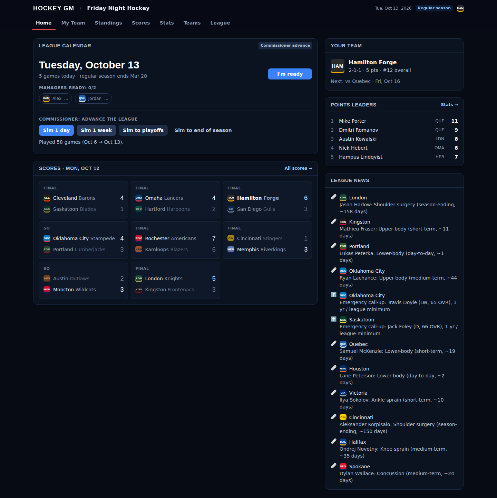
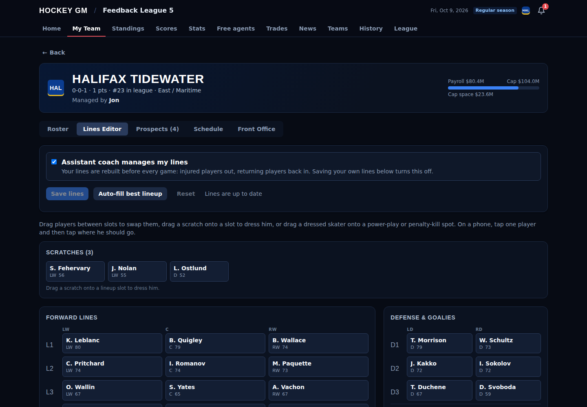
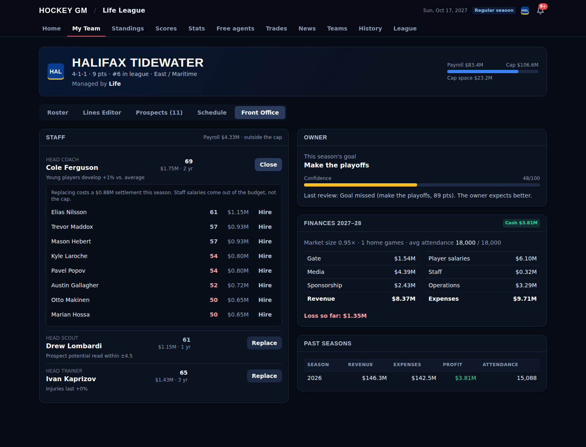
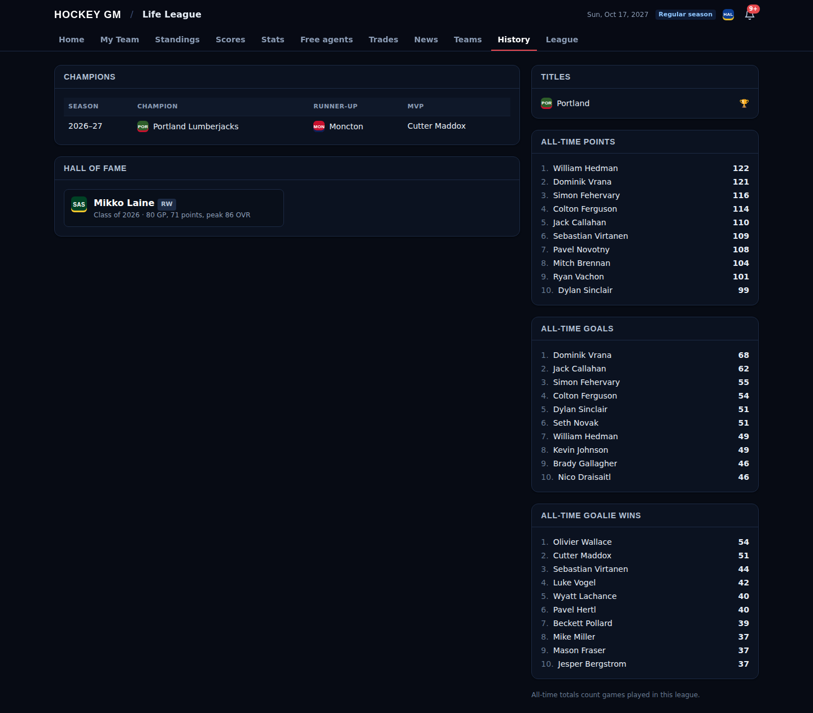
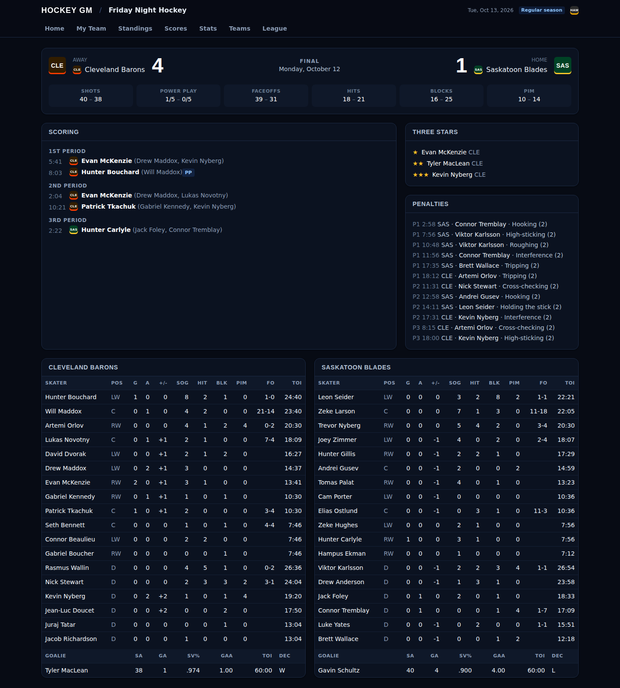
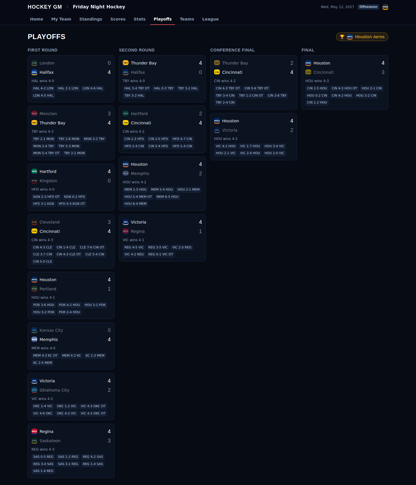

# Hockey GM

A multiplayer hockey management game. Each friend manages a team in a 32-team league,
and the other teams are run by AI. The simulation is deep: a second-by-second game
engine, fatigue, injuries, NHL-format playoffs and awards. Leagues also run for
decades: players develop and age, stars retire, and every summer brings a draft,
re-signings and free agency.



## Quick start

```bash
npm install
npm run dev
```

Then open **http://localhost:5173**, create an account, and create a league. To invite
friends, share the invite code from the **League** tab. Each of them creates an account,
joins with the code and picks a team.

- The API runs on port 3001, and Vite proxies `/trpc` to it.
- Data is stored in an embedded Postgres (PGlite) under `./.data/pglite`, so there's
  nothing to install. Delete that folder to start fresh.
- Requires Node 20+.

To play with friends before anything is deployed, run it on your machine and share it
through a tunnel (e.g. `npx localtunnel --port 5173` or Tailscale).

### Other commands

```bash
npm test              # 83 tests: sim determinism, playoffs, offseason, contracts, trades, league life and the multiplayer API
npm run typecheck     # all three packages
npm run demo          # sim a season in the terminal: box score, standings, injuries, bracket, awards
npm run calibrate     # sim 10 seasons and compare league stats to real NHL figures
npm run dynasty 10    # one league for 10 seasons: talent, scoring and ages should stay stable
```

### Moving to Supabase (or any hosted Postgres)

Set `DATABASE_URL` to the connection string and start the server. Migrations run
automatically at startup; they're plain SQL in `packages/server/src/schema.ts`.

```bash
DATABASE_URL="postgresql://postgres:<password>@db.<project>.supabase.co:5432/postgres" npm run dev
```

## How it's built

```
packages/
  sim-core/   pure TypeScript simulation, no I/O (runs in Node or a browser)
  server/     Fastify + tRPC API, auth, league storage, advance engine and scheduler
  web/        React + Vite + TanStack Query + Tailwind
tools/        calibration + terminal demo
```

| Layer | Choice | Notes |
|---|---|---|
| Simulation | `@hockey-gm/sim-core` | Deterministic: every game's seed comes from the league seed + season + game id |
| API | Fastify + tRPC 11 | End-to-end types: the web app imports the server's router type |
| Database | PGlite locally, Postgres/Supabase later | A thin SQL layer (`db.ts`) runs the same queries on both |
| Auth | Username + password (scrypt), server sessions in an httpOnly cookie | Can be swapped for Supabase Auth later; only `userFromToken` needs to change |
| Scheduling | `croner`, one cron job per scheduled league | Recreated from the DB at startup |

**Storage model.** The live league (players, teams, schedule, stats) is one JSONB
document with a version number; every write is an optimistic-concurrency update inside
a transaction that holds a row lock. Box scores make up about 85% of a season's data, so
they're moved to their own table after each advance and loaded only when someone opens a
game. Membership, ready flags and the advance audit log are ordinary tables.

**Hidden information.** Potential, personality, injury-proneness and consistency never
leave the server. Scouting will reveal estimates of them in a later phase.

## Multiplayer

### Advancing the league

Pick one of two modes on the **League** tab (commissioner only):

- **Commissioner:** the commissioner presses *Sim 1 day / 1 week / to playoffs / to end
  of season*. Good for live sessions together.
- **On a schedule:** a cron schedule in the league's time zone (presets include
  "every night at 11 PM"), a number of days per tick, and optionally **advance early
  when every manager is ready**. The commissioner can still force an advance at any time.

Every advance, whatever triggered it, goes through the same code path: take a lock,
simulate, save the state and box scores, clear ready flags, and write to the audit log
(*League → Advance history*). Because each game has its own seed, simming 7 days one at a
time produces exactly the same league as simming a week at once. The tests check this.

### Managing your team

- **Roster:** ratings, season stats, contracts and injury status.
- **Lines editor (drag and drop):** 4 forward lines, 3 D pairs, starter/backup goalie,
  2 PP units and 2 PK units. Drag a scratch onto a slot to dress him, drag between slots
  to swap, or drag a dressed skater onto a PP/PK spot. On a phone, tap one player and then
  tap where he goes. When you swap someone out, their power-play and penalty-kill spots go
  to the replacement, and the editor flags injured or out-of-position players.
- **Assistant coach** (on by default): rebuilds your lines before every game, taking
  injured players out and putting returning players back in. Saving your own lines hands
  control back to you. If you're managing lines yourself, the dashboard warns you when a
  better healthy player is sitting out.



## Seasons that never end: the career loop

When the final ends, the league enters the offseason. Each stage waits for managers
unless the commissioner or the schedule moves on, and nobody can stall the league:
anyone who hasn't acted gets sensible defaults.

| Stage | What happens | What you do |
|---|---|---|
| **Season review** | Nothing changes yet, so final stats and awards can be browsed | Look around |
| **Entry draft** | A new class of ~260 teenagers and an NHL-style lottery (two draws, max 10-spot jump); 7 rounds | Pick when you're on the clock, or rank a **draft list** that's used if you're away |
| **Re-sign** | Players age and develop over the summer, veterans retire, contracts expire | **Negotiate** with each expiring player, qualify RFAs, or let them go |
| **Free agency** | Three **blind-bidding rounds**: every free agent takes the best offer he receives; AI teams bid too | Place sealed bids; leftover players sign at their ask during camp |
| **Training camp** | AI teams promote ready prospects and cut to 23 | Promote prospects, send down, release |
| **New season** | Career stats archived, new schedule, cap grows 2.5% | — |

- **Development:** young players close part of the gap to their hidden potential each
  year, faster with real NHL ice time. Veterans decline from about 30, speed first
  and hockey sense last, and goalies peak later. Breakouts and busts happen.
- **Scouting:** potential is never shown. Your scouts give draft prospects and young
  players a grade (A+ … F) and a projection ("Top-six / top-four"). Every team's scouts
  make different, repeatable errors.
- **Prospects:** draft picks develop outside the 23-man roster and the cap. Promoting
  one signs a 3-year entry-level deal. Unsigned prospects are released at 23.
- **Careers:** every player has a career page with season-by-season stats, draft
  info, awards and ratings. Retired players keep their pages.
- **Long-run balance:** each summer ratings are nudged back toward the league's
  original talent mean and spread, so there's no inflation or deflation over decades.
  Without this, the game-sim calibration would drift. In a 10-season test, talent
  stayed within 68.7–69.6, goals per game within 2.85–3.08, and 8 different teams won.

## Contracts

- **Interest in your team (0–100):** each player rates every team on whether it can win
  (weighted by his ambition), the role he'd have, loyalty to his current or drafting team,
  market size (greedier players like the spotlight), the head coach (young players) and
  a recent title. You see the rating and the reasons (e.g. "▲▲ Would be a top player here",
  "▼ Small market"), never the hidden numbers.
- **Asks are per team:** interest sets what he asks *you* for. An interested player
  gives up to ~20% off and commits a year longer; an uninterested one wants up to 25% more
  and a shorter way out.
- **Money versus term:** each player weighs the two his own way. Greed sets how much money
  moves him; age and a personal appetite for security set how term does. Veterans pay more
  for a short deal and take less per year for extra years (up to three); young players
  resist being locked in long. The agent's estimate for every term from 1 to 8 years is
  shown (with a little noise), and a live **agent's read** meter reacts as you move the
  salary and years **sliders** (or type the numbers).
- **Negotiation:** he accepts, counters (at his preferred term, or yours if it barely
  matters to him), or, if you lowball him, gets annoyed and raises his price. You get
  three offers per player per window. The AI goes through the same function.
- **Restricted free agents:** RFAs can be qualified. If you don't reach a deal, he stays
  on a one-year qualifying offer at 105% of his salary.
- **Blind-bid free agency:** managers in different time zones get the same shot,
  because what counts is the best offer, not who clicked first. Teams under the
  salary floor overpay to reach it.
- **Extensions:** negotiate with players in the final year of their deal during
  the season. The new deal kicks in when the old one ends.
- **Leftover free agents:** after the bidding rounds (training camp and in season),
  **Sign** opens a negotiation; he signs on the spot when he accepts.
- **Buyouts:** releasing a player under contract costs two-thirds of the remaining
  money (one-third if he's under 26), spread over twice the remaining years as dead cap.
- **Pay scale:** salaries scale with the cap, which grows 2.5% a year. Typical
  payrolls sit between the floor and the cap.

## Trades

- **Trade center:** pick a team, tick players, prospects and draft picks on both sides,
  and see the cap impact for both teams. Future picks (this draft plus the next two)
  are tradeable, and the draft uses whoever owns each pick.
- **AI teams value assets from their own point of view.** Stars are worth far more
  than depth, young players carry scouted upside, age brings decline, and cheap good
  contracts are gold while overpaid ones hurt. Pending UFAs are rentals, and picks are
  valued by projected slot. Contenders pay for help now; rebuilders pay for youth and
  picks. What an AI receives is summed with diminishing weights, so three depth players
  never buy a star, and it wants to come out slightly ahead.
- **Feedback without the numbers:** an interest meter ("Close, but we'd need a little
  more"), and a **"What would they want?"** button that finds the cheapest addition
  (up to three assets) from your side that gets it done.
- **Human-to-human** proposals with accept/decline/withdraw. Proposals are voided if
  their assets move. An optional **commissioner review** holds trades involving managers
  until approved (anti-collusion).
- **Deadline:** trades freeze after ~78% of the regular season through the playoffs,
  and during the draft.
- **AI-to-AI trades:** contenders buy veterans and pending UFAs from rebuilding teams
  with prospects and picks, more often near the deadline, and at most two deals per team
  per season so nobody guts a roster.

## League life

- **Front office:** every team has a head coach, head scout and head trainer, rated
  40–95. The coach speeds up young players' development (about −8% to +10%), the scout
  narrows the fog on prospects' potential, and the trainer shortens injuries (about
  +17% to −20%). An average staffer (65) is neutral. Replace anyone from the job market
  on your team's **Front office** tab (12 candidates per role, always including a few
  strong ones, with each one's effect shown); the outgoing staffer's settlement comes
  out of the budget. Staff are paid outside the salary cap. AI teams upgrade weak staff each summer.
- **Finances:** attendance and gate follow market size, winning, star power and last
  year's title. Media and sponsorship revenue, salaries (including dead cap), staff and
  operations are booked game by game, and playoff home games are pure upside. Books close
  each summer and profit or loss rolls into the team's cash.
- **Owners:** each owner sets a goal for the season (contend, make the playoffs, develop
  youth or turn a profit) and reviews you after the final. Confidence rises and falls with results.
- **News:** hat tricks, five-point nights, 50-goal and 100-point milestones, streaks,
  playoff shutouts and OT winners, awards, series clinches and champions, plus trades,
  big signings, long injuries to good players, notable retirements and the #1 pick,
  all drawn from the transaction log.
- **Notifications:** a bell in the header for things that need you: your results,
  trade proposals and replies, commissioner approvals, being on the clock in the draft,
  free-agency wins and losses, and offseason stage changes. They are stored per user,
  so they're waiting when you come back.
- **History:** champions and MVPs by season, title counts, the **Hall of Fame** (retired
  players are scored on production, awards, titles and peak, with credit for careers that
  began before the league existed) and all-time leaders.
- **Assistant GM:** if a manager never decides on an expiring player, the assistant GM
  handles him the way an AI team would, so an absent manager can't lose half a roster.
  An explicit "let go" is always respected.

 

## The simulation

Each second, each team can generate a shot attempt, penalty, hit, fight, injury or
stoppage, with rates driven by the skaters on the ice:

- **Shot attempts** depend on on-ice offense against the opposing defense, the
  strength state (5v5, 5v4, 4v4, 3v3 OT, 6v5 with the goalie pulled…), home ice and
  score effects. Each attempt is blocked, missed or on goal. The chance of a goal
  combines the shooter, his teammates' playmaking and the goalie. Saves can produce
  rebounds.
- **Deployment:** shifts rotate toward target ice-time shares, PP and PK units take
  over on penalties, trailing teams pull the goalie late, and a struggling starter gets
  pulled.
- **Fatigue:** players lose energy on the ice and recover on the bench at rates set by
  their endurance. Teams on the second night of a back-to-back start tired and usually
  start the backup goalie.
- **Injuries:** players get hurt mid-game (more often if injury-prone). There are five
  severity tiers, from day-to-day to season-ending, and players heal one day at a time.
  A team that can't dress a full lineup makes an emergency call-up.
- **Overtime:** in the regular season, 5 minutes of 3v3 sudden death and then a
  shootout. In the playoffs, full-strength 20-minute sudden-death periods.
- **Season flow:** an 82-game regular season, then awards (Hart, Art Ross, Richard,
  Vezina, Norris, Selke, Calder, Presidents') → a 16-team best-of-seven playoff with
  2-2-1-1-1 home ice → the Conn Smythe → a history record.

**Calibration:** all 33 league-wide checks land within tolerance of recent NHL figures.
They cover scoring, shots, save %, special teams, OT and shootouts, home ice, parity,
scoring leaders, ice time, goalie ranges, injuries, backup usage, series length and
playoff OT rate. Some targets are approximate.

 

## Known limitations

- One server process: the scheduler and the per-league lock live in memory. Running
  several API instances would need a Postgres advisory lock and a single scheduler.
- A full-season "sim to end" takes a few seconds and blocks the API while it runs.
  It should move to a worker thread before the game is hosted.
- Live updates use 5-second polling. Supabase Realtime can replace it later.
- No offer sheets for RFAs yet (qualifying offers only), and no retained salary in trades.
- The league document grows about 0.3 MB per season of history (careers, retirees).

## Roadmap

- **Phase 7, hosting:** Supabase for the database, sims moved to a worker thread,
  Supabase Realtime instead of polling, email or push for notifications, and deployment.
- **Depth:** RFA offer sheets, retained salary in trades, arena and ticket-price decisions,
  owners who fire GMs, and a minor-league affiliate with its own games.
